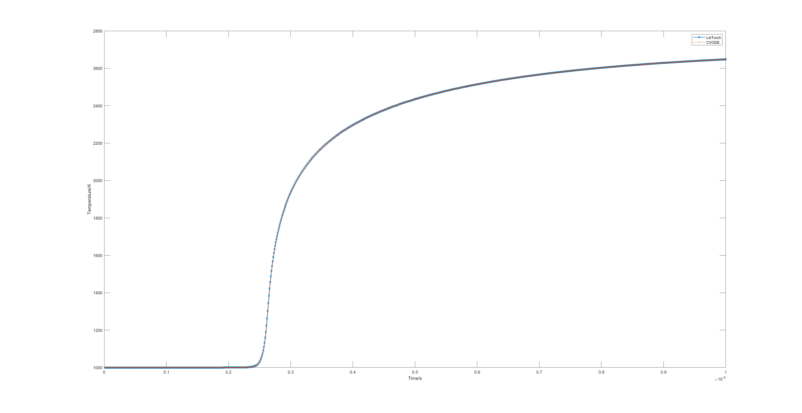

Libtorch Integrator
===================
If you choose to use LibTorch as the integratgor and use the compilation flag `--libtorch_dir`, you can run examples stored in `$HOME/deepflame-dev/examples/.../libtorchIntegratgor`. To run an example, you first need to source your OpenFOAM:

.. code-block:: bash

    source $HOME/OpenFOAM/OpenFOAM-7/etc/bashrc

Then, source your DeepFlame:

.. code-block:: bash

    source $HOME/deepflame-dev/bashrc

Next, you can go to the directory of any example case that you want to run. For example:

.. code-block:: bash

    cd $HOME/deepflame-dev/examples/zeroD_cubicReactor/H2/libtorchIntegratgor

This is an example for the zero-dimensional hydrogen combustion with LibTorch as the integrator. All files needed by DNN are listed under the case folder. Configurations regarding DNN are included in `constant/CanteraTorchProperties`.

The case is run by simply typing: 

.. code-block:: bash

    ./Allrun

.. Note:: Users can go to `constant/CanteraTorchProperties` and check if `torch` is switched on. Switch it `on` to run DNN cases, and switch `off` to run CVODE cases.

If you plot LibTorch's result together with CVODE's result, the graph is expected to look like:

    
    Visualisation of 0D results from LibTorch and CVODE integrators 
