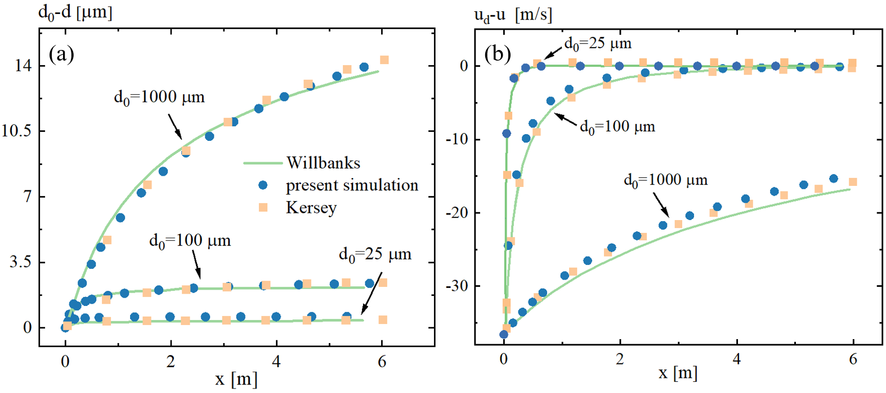
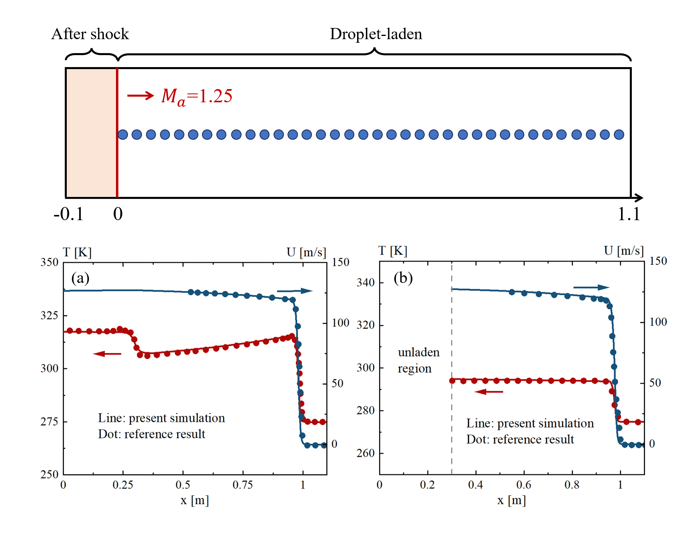
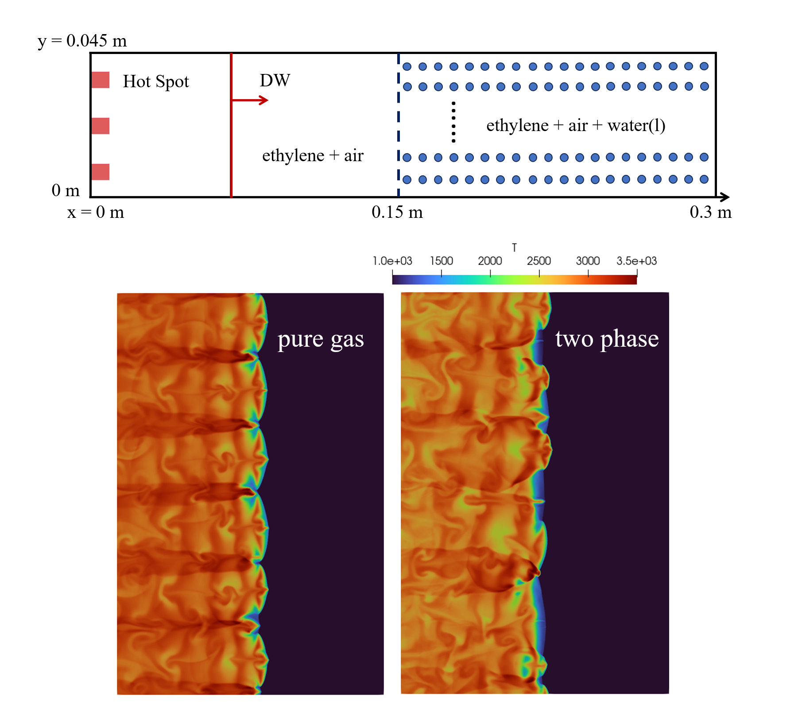
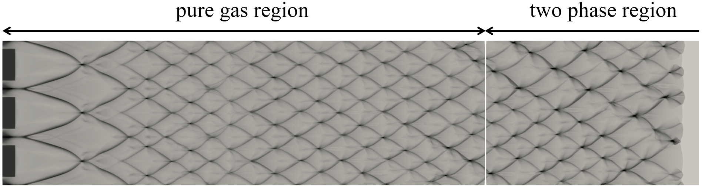

dfHighSpeedFoam
==================

One-Dimensional Reactive Shock Tube
----------------------------------------

**Problem Description**

The case simulates supersonic inlet flow hitting the wall and then reflected to ignite the premixed gas. The reactive wave will catch the reflected shock wave. This case can also verify the accuracy of our solver in capturing the interaction of convection and reaction.

.. list-table:: Operating Conditions in Brief
   :widths: 40 40 
   :header-rows: 0

   * - Chamber size (x)
     - 0.12 m
   * - Initial Gas Density
     - 0.072 kg/m^3 (x<=0.06 m), 0.18075 kg/m^3 (x>0.06 m) 
   * - Initial Gas Pressure
     - 7173 Pa (x<=0.06 m), 35594 Pa (x>0.06 m)
   * - Initial Gas Velocity
     - 0 m/s (x<=0.06 m), -487.34 m/s (x>0.06 m)
   * - Ideal Gas Composition (mole fraction)
     - H2/O2/Ar = 2/1/7 

**Output** 

.. figure:: 1D_reactive_shock_tube.png
   :width: 500
   :align: center

   Result of one-dimensional reactive shock tube

**Reference**

E S Oran, T R Young, J P Boris, A Cohen, Weak and strong ignition. i. Numerical simulations of shock tube experiments, Combustion and Flame 48 (1982) 135-148.

R J Kee, J F Grcar, M D Smooke, J A Miller, E Meeks, Premix: A fortran program for modeling steady laminar one-dimensional premixed flames, Sandia National Laboratories.

One-Dimensional H2/Air Detonation
--------------------------------------------

**Problem Description**

Detonation propagation contains a complex interaction of the leading shock wave and auto-igniting reaction, showing the coupling of shock wave and chemical reaction. This case aims to validate the accuracy of this solver in capturing this process and the propagation speed.

.. list-table:: Operating Conditions in Brief
   :widths: 40 40 
   :header-rows: 0

   * - Chamber size (x)
     - 0.5 m
   * - Initial Gas Pressure
     - 90 atm (hot spot), 1 atm (other area)
   * - Initial Gas Temperature
     - 2000 K (hot spot), 300 K  (other area)
   * - Ideal Gas Composition (mole fraction)
     - H2/O2/N2 = 2/1/3.76
       (homogeneous stoichiometric mixture)

**Output** 

.. figure:: 1D_air_detonation.png
   :width: 500
   :align: center

   Result of one-dimensional H2/air detonation

**Reference**

J Li, Z Zhao, A Kazakov, F L Dryer, An updated comprehensive kinetic model of hydrogen combustion, International Journal of Chemical Kinetics 36 (2004) 566-575.

Two-Dimensional H2/Air Detonation
--------------------------------------------

**Problem Description**

Detonation propagation contains a complex interaction of the leading shock wave and auto-igniting reaction, and two-dimensional detonation can further reveal the interaction of shear waves and shock waves.

.. list-table:: Operating Conditions in Brief
   :widths: 40 40 
   :header-rows: 0

   * - Chamber size (x)
     - 0.2 m * 0.01 m
   * - Initial Gas Pressure
     - 100 atm (three hot spot), 1 atm (other area)
   * - Initial Gas Temperature
     - 2000 K (three hot spot), 300 K  (other area)
   * - Ideal Gas Composition (mole fraction)
     - H2/O2/N2 = 2/1/7
       (homogeneous stoichiometric mixture)

**Output** 

Triple points can be seen clearly in the picture below.

.. figure:: 2D_detonation_rho.png
   :width: 500
   :align: center

   Density field of two-dimensional H2 detonation

In the picture below, during the propagation of detonation wave, we can see that the size of cells gradually became stable.

.. figure:: 2D_detonation_pMax.png
   :width: 500
   :align: center
   
   History of maximum pressure during detonation propagation

**Reference**

C J Jachimowski, An Analytical Study of the Hydrogen-Air Reaction Mechanism with Application to Scramjet Combustion, NASA TP-2791, Feb. 1988.

One-Dimensional Single Droplet Motion
----------------------------------------

**Problem Description**

This case simulates the motion of single droplet within a wind tunnel. By getting the droplet's velocity and diameter at various locations, the precision of evaporation and momentum models under low-velocity flow conditions can be validated.

.. list-table:: Operating Conditions in Brief
   :widths: 40 40 
   :header-rows: 0

   * - Chamber size (x)
     - 6.096 m
   * - Initial Gas Phase Condition
     - v = 67.056 m/s, T = 273.33 K
   * - Ideal Gas Composition (mass fraction)
     - H2O : O2 : N2 = 0.003175 : 0.232260 : 0.764565
   * - Initial Water Droplet Condition
     - v = 30.48 m/s, T = 333.33 K, d = 25/100/1000 e-06 m

**Output** 

   Result of one-dimensional single droplet motion

**Reference**

J Kersey, E Loth, D Lankford. Effect of evaporating droplets on shock waves. AIAA journal (2010) 48(9): 1975-1986.

C E Willbanks, R J Schulz. Analytical study of icing simulation for turbine engines in altitude test cells. Journal of Aircraft (1975) 12(12): 960-967.

One-Dimensional Shock Attenuation by Evaporating Drops
-------------------------------------------------------

**Problem Description**

This case simulates the attenuation of shock wave as it traverses the water mist, thereby validating the ability of this solver to capture the interaction between shock wave and droplets.

.. list-table:: Operating Conditions in Brief
   :widths: 40 40 
   :header-rows: 0

   * - Chamber size (x)
     - 1.2 m
   * - Preshocked Gas Phase Condition 
     - T = 275 K, p = 0.66 bar
   * - Initial mach number 
     - Ma = 1.25
   * - Ideal Gas Composition (mass fraction)
     - H2O : O2 : N2 = 0.00646 : 0.23149482 : 0.76204518
   * - Initial Water Droplet Condition
     - v = 0 m/s, T = 275 K, d = 2.4 e-06 m, mass loading = 0.5~0.6%

**Output** 

   Numerical setup and result of shock attenuation by evaporating drops

**Reference**

J Kersey, E Loth, D Lankford. Effect of evaporating droplets on shock waves. AIAA journal (2010) 48(9): 1975-1986.

Two-Dimensional Detonation in Water-droplet-laden C2H4/air Mixtures
--------------------------------------------------------------------

**Problem Description**

A two-dimensional detonation of stoichiometric C2H4/air gas with water droplets is simulated to evaluate the efficacy of this solver in capturing interphase coupling and the cellular structure of the detonation front in two-phase mixture with non-reacting sprays.

.. list-table:: Operating Conditions in Brief
   :widths: 40 40 
   :header-rows: 0

   * - Chamber size (x)
     - 0.3 m * 0.045 m
   * - Initial Gas Condition
     - 100 atm (three hot spot), 1 atm (other area), phi = 1
   * - Initial Gas Temperature
     - 3000 K (three hot spot), 300 K  (other area)
   * - Initial Water Droplet Condition
     - v = 0 m/s, T = 300 K, d = 11 e-06 m, mass fraction = 7.1%

**Output** 

   Numerical setup and result of detonation in water-droplet-laden C2H4/air mixtures

In the picture below, during the propagation of detonation wave, we can see that the size of cells gradually became stable in pure gas mixture and the cell size become slightly larger in two-phase region.

   
   History of maximum pressure during detonation propagation

**Reference**

D J Singh, C J Jachimowski. Quasiglobal reaction model for ethylene combustion. AIAA J (1994) 32:213-6. 